## 1. Installation

1. Install [Git SCM](https://git-scm.com/downloads)
2. Install [Github Desktop](https://desktop.github.com/)
3. Register an account and login to Github Desktop

## 2. Preparation

1. Create the Unity project with the Unity Hub

2. Create a new repository with Github Desktop

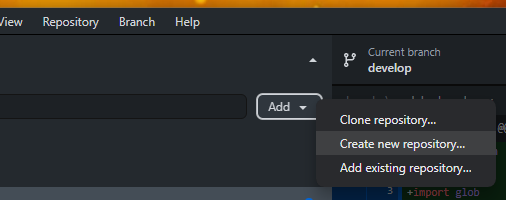

3. Fill out the repository information
   * The name has to be the same as the project you created in the Unity Hub
   * Select the **parent directory** in which your already created project directory lies
   * Select **Unity** as the gitignore option
   * Select a license (Optional)

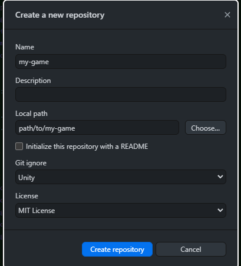

4. Publish the repository to Github
    * Use the same name as before
    * Choose whether you want the repository to be public or private

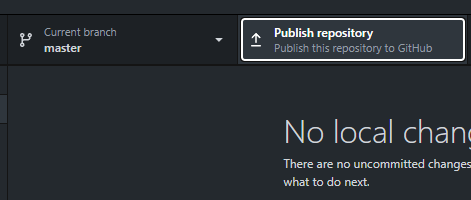 
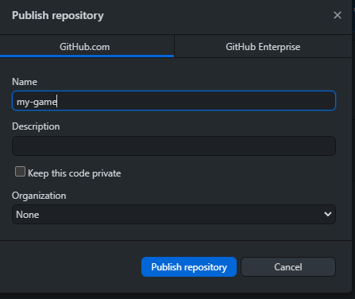

5. Add Collaborators to your repository
    * Navigate to your repository page on https://github.com
    * Click on Settings -> Collaborators
    * Add your team members by username or email
    * Your team mate will receive an email with the invitation link

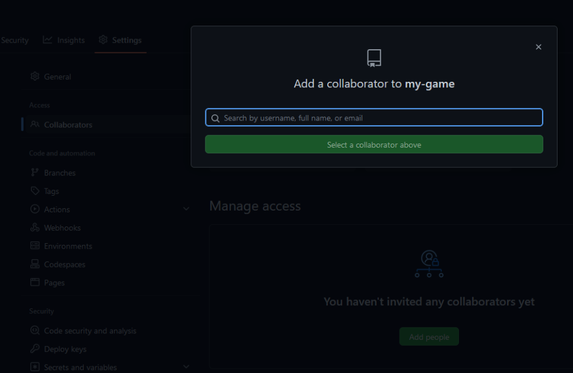

## 3. Workflow

1. Create a branch in Github Desktop
    * Select the branch dropdown
    * Click on `New branch`
    * Choose a name that represents what you will work on on this branch

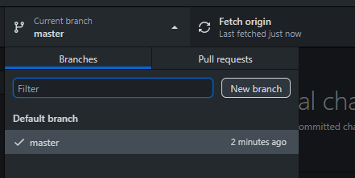 
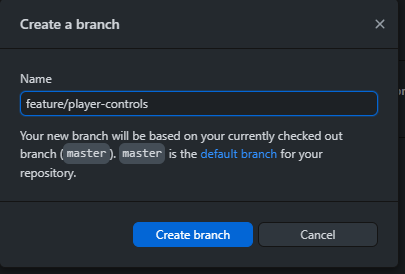

2. Commit changes to the branch
    * Select which changes you want to commit
    * Use meaningful commit messages that describe the set of changes in this commit
    * Commit and push the changes

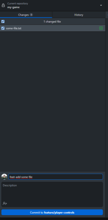 
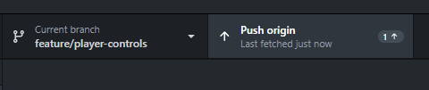

3. Create a Pull Request
    * Create the PR by clicking `Preview Pull Request` in Github Desktop
    * Click `Create pull request` on Github

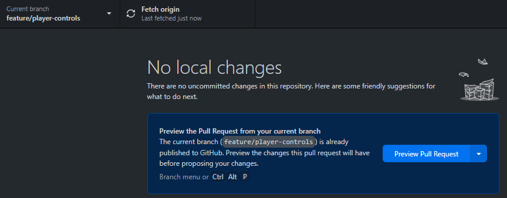 
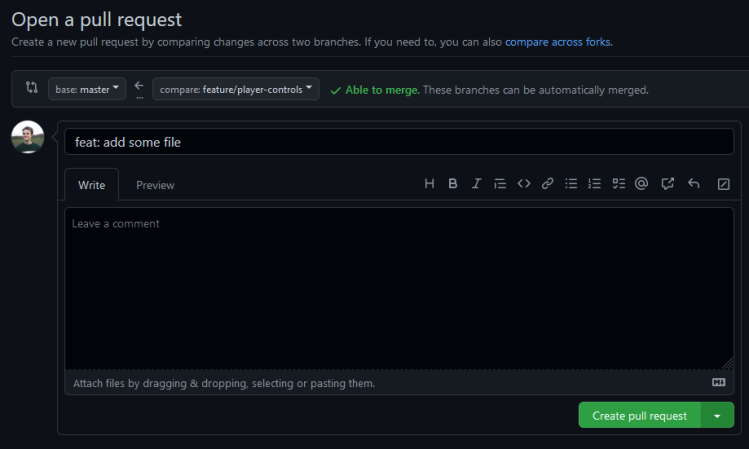

4. Merge the Pull Request on Github
    * If there are any conflicts, click on `Open in Github Desktop`, resolve the conflicts using a code editor or by removing the files in question and commit the changes to the PR
    * Click `Merge pull request` and delete the branch if it is not needed anymore

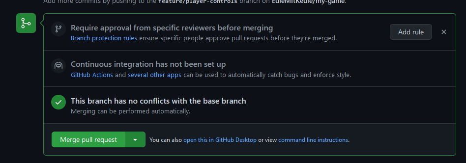 
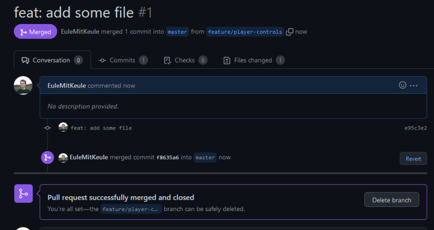